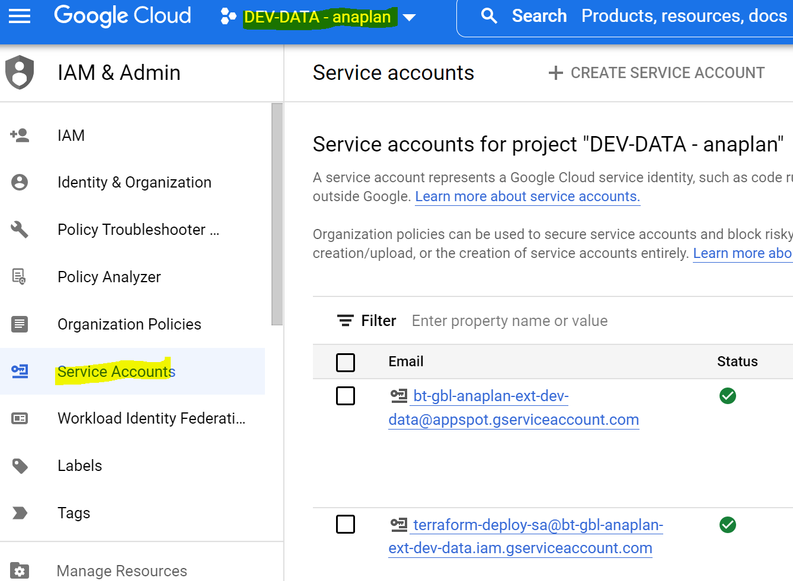
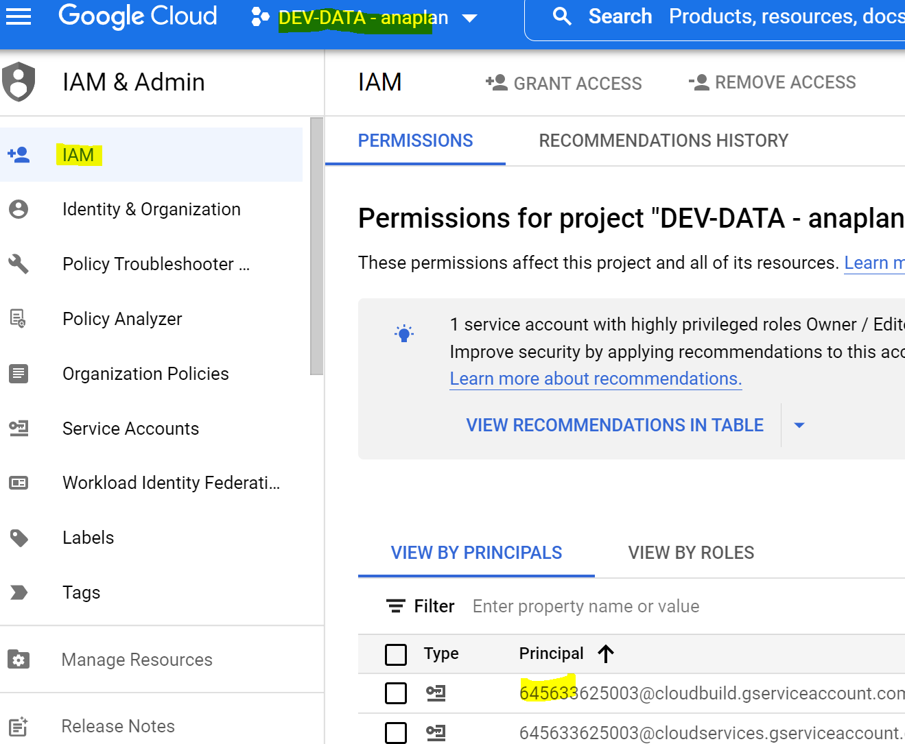

# IAM
## Service accounts
List of service accounts in a project  
`gcloud iam service-accounts list --project  <bt-gbl-service-view-dp-dev>`


List of IAM roles assigned to the project
`gcloud projects get-iam-policy`



1. Authenticate with GCP
	`gcloud auth login`
	Note: Above command opens a browser and login with your GCP credentials.
2. List the projects accessible by the current user
	`gcloud projects list`
3. Set the project
	`gcloud config set project PROJECT_ID`
4. List the current project
	`gcloud config get-value project`

## List of components installed
i.e bq,gsutil

`gcloud components list`
```
Your current Google Cloud CLI version is: 410.0.0
The latest available version is: 412.0.0

+---------------------------------------------------------------------------------------------------------------+
|                                                   Components                                                  |
+------------------+------------------------------------------------------+--------------------------+----------+
|      Status      |                         Name                         |            ID            |   Size   |
+------------------+------------------------------------------------------+--------------------------+----------+
| Update Available | BigQuery Command Line Tool                           | bq                       |  1.6 MiB |
| Update Available | Cloud Storage Command Line Tool                      | gsutil                   | 15.5 MiB |
| Update Available | Google Cloud CLI Core Libraries                      | core                     | 25.9 MiB |
```

